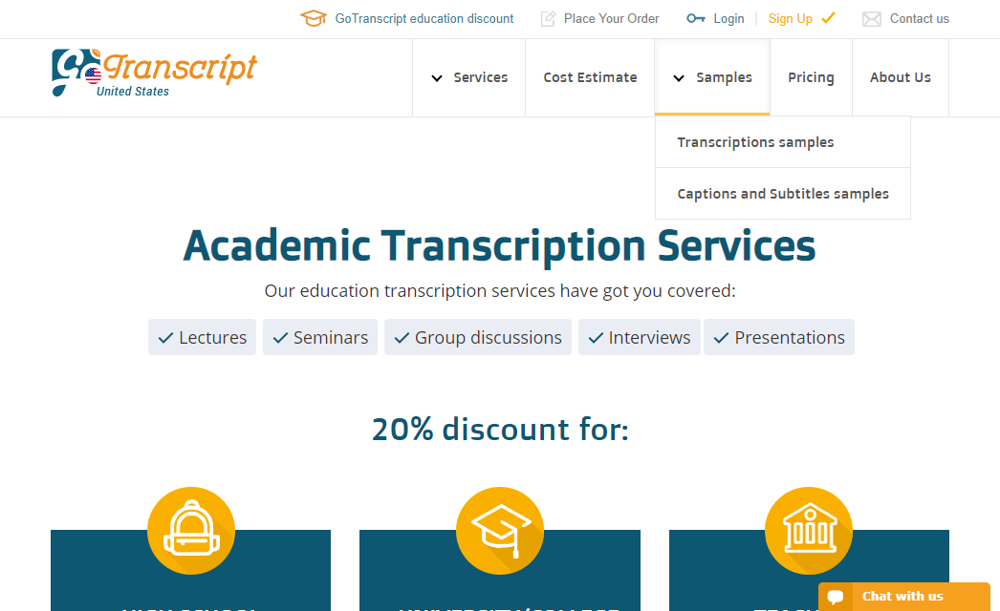
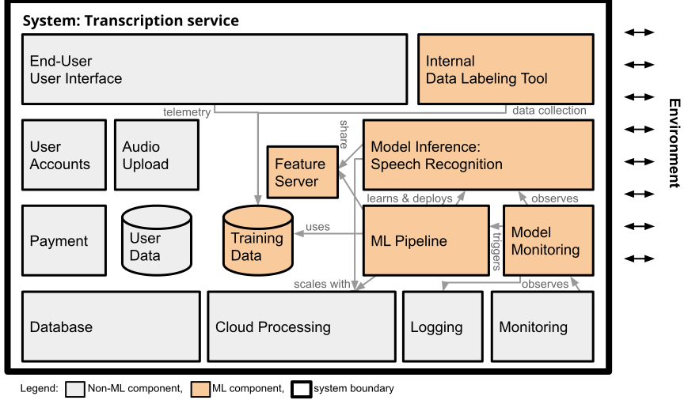

# We are back online :(

If you can hear me, open the participant panel in Zoom and check "yes"


----
## This is not normal. We understand.


<!-- .element: class="stretch" -->


Note: Picture AP Photo/Noah Berger, https://www.abc27.com/news/thats-2020-photographers-california-wildfire-image-a-sign-of-the-times/

----
## This is not normal. We understand.

Expect:
* Internet and bandwidth issues
* Timezone issues?
* Distractions -- parents, siblings, pets
* Feeling isolated, feeling overwhelmed
* Additional sources of stress
* Hard time dealing with -gestures widely- *everything*...

*Talk to us about accommodations of any kind*


----
## Simulating in-class experience

> Discussions and interactions are important. We'll have regular in-class discussions and exercises

* Use chat, "raise hand" feature, or just speak
* If possible, keep camera on, muted by default
* Set preferred name in Zoom
* Synchronous "live" attendance only
* 
* Suggestion: Have chat and participant list open, maybe separate window for gallery view for faces, second monitor highly recommended
* **Contact us for accommodations!**


----
## Catastrophic Success


----
## Personal Connection

> This is hard. We know.

* Talk inside and outside of class
* We are here always 10 min before class and stay after class if you have questions, want to chat
* We encourage collaboration in all assignments, even "individual" assignments and reading quizzes
* We encourage social activities in teams


---

## Learning Goals

* Understand how ML components are parts of larger systems
* Illustrate the challenges in engineering an ML-enabled system beyond accuracy
* Explain the role of specifications and their lack in machine learning and the relationship to deductive and inductive reasoning
* Summarize the respective goals and challenges of software engineers vs data scientists
* Explain the concept and relevance of "T-shaped people"

---

# Disclaimers

This class captures a rapidly evolving field. 

We are scaling from 30 to 150 students. Expect some friction.

We are software engineers.

---

# Agenda

```mermaid
graph LR;
    Preliminaries --> C["Case Study"];
    C --> Syllabus;
    Syllabus --> Introductions;
```

---

# Case Study: The Transcription Service Startup

----



----

## Transcription services

* Take audio or video files and produce text.
    - Used by academics to analyze interview text
    - Podcast show notes
    - Subtitles for videos

* State of the art: Manual transcription, often mechanical turk (1.5 $/min)

----

## The startup idea

PhD research on domain-specific speech recognition, that can detect technical jargon

DNN trained on public PBS interviews + transfer learning on smaller manually annotated domain-specific corpus

Research has shown amazing accuracy for talks in medicine, poverty and inequality research, and talks at Ruby programming conferences; published at top conferences

Idea: Let's commercialize the software and sell to academics and conference organizers

----

## Short Breakout

**Likely challenges in building commercial product?**

* Think about challenges that the team will likely focus when turning their research into *a product*:
  * One machine-learning challenge
  * One engineering challenge in building the product
  * One challenge from operating and updating the product
  * One team or management challenge
  * One business challenge
  * One safety or ethics challenge

* Fill out one form per team and meet back here in 8 minutes to share suggestions

----

## What qualities are important for a good commercial transcription product?

<!-- discussion -->


----
## ML in a Production System


<!-- .element: class="plain" -->


----
## ML in a Production System



<!-- .element: class="plain" -->


----


Notes: Highlights challenging fragments. Can see what users fix inplace to correct. Star rating for feedback.


----

<svg version="1.1" viewBox="0.0 0.0 800 400" xmlns:xlink="http://www.w3.org/1999/xlink" xmlns="http://www.w3.org/2000/svg">
        <style>
    text { font: 60px sans-serif; }
        </style>
        <circle r="180" cx="250", cy="200" fill="#b9ff00" fill-opacity="0.514" />
        <circle r="180" cx="550", cy="200" fill="#ff5500" fill-opacity="0.514" />
        <text x=230 y=160 dominant-baseline="middle" text-anchor="middle">Data</text>
        <text x=230 y=240 dominant-baseline="middle" text-anchor="middle">Scientists</text>
        <text x=570 y=160 dominant-baseline="middle" text-anchor="middle">Software</text>
        <text x=570 y=240 dominant-baseline="middle" text-anchor="middle">Engineers</text>
</svg>

and Data engineers + Domain specialists + Operators + Business team + Project managers + Designers, UI Experts + Safety, security specialists + Lawyers + Social scientists + ...

----
## Data scientist

* Often fixed dataset for training and evaluation (e.g., PBS interviews)
* Focused on accuracy
* Prototyping, often Jupyter notebooks or similar 
* Expert in modeling techniques and feature engineering
* Model size, updateability, implementation stability typically does not matter

<!-- split -->

## Software engineer

* Builds a product
* Concerned about cost, performance, stability, release time
* Identify quality through customer satisfaction
* Must scale solution, handle large amounts of data
* Detect and handle mistakes, preferably automatically
* Maintain, evolve, and extend the product over long periods
* Consider requirements for security, safety, fairness

----

## Likely collaboration challenges?

* Everybody, **type one or two likely collaboration challenges in the chat but *do not send them yet*. Vote "yes" when done.**

<!-- discussion -->


----
## What might Software Engineers and Data Scientists Focus on?


----


<!-- .element: class="plain" -->


<!-- references -->
By Steven Geringer, via Ryan Orban. [Bridging the Gap Between Data Science & Engineer: Building High-Performance Teams](https://www.slideshare.net/ryanorban/bridging-the-gap-between-data-science-engineer-building-highperformance-teams/3-Software_Engineer_Data_Engineer_Data). 2016


----
## T-Shaped People

*Broad-range generalist + Deep expertise*


<!-- .element: class="plain" -->


<!-- reference -->
Figure: Jason Yip. [Why T-shaped people?](https://medium.com/@jchyip/why-t-shaped-people-e8706198e437). 2018

----
## T-Shaped People

*Broad-range generalist + Deep expertise*

Example:
* Basic skills of software engineering, business, distributed computing, and communication
* Deep skills in deep neural networks (technique) and medical systems (domain)


----

## Examples for discussion

* What does correctness or accuracy really mean? What accuracy do customers care about?
* How can we see how well we are doing in practice? How much feedback are customers going to give us before they leave?
* Can we estimate how good our transcriptions are? How are we doing for different customers or different topics?
* How to present results to the customers (including confidence)?
* When customers complain about poor transcriptions, how to prioritize and what to do?
* 
* What are unacceptable mistakes and how can they be avoided? Is there a safety risk?
* Can we cope with an influx of customers?
* Will transcribing the same audio twice produce the same result? Does it matter? 
* How can we debug and fix problems? How quickly?

----

## Examples for discussion 2

* With more customers, transcriptions are taking longer and longer -- what can we do?
* Transcriptions sometimes crash. What to do?
* How do we achieve high availability?
* How can we see that everything is going fine and page somebody if it is not?
* We improve our entity detection model but somehow system behavior degrades... Why?
* Tensorflow update; does our infrastructure still work?
* Once somewhat successful, how to handle large amounts of data per day?
* Buy more machines or move to the cloud?
*
* Models are continuously improved. When to deploy? Can we roll back?
* Can we offer live transcription as an app? As a web service?
* Can we get better the longer a person talks? Should we then go back and reanalyze the beginning? Will this benefit the next upload as well?

----

## Examples for discussion 3

* How many domains can be supported? Do we have the server capacity?
* How specific should domains be? Medical vs "International Conference on Allergy & Immunology"?
* How to make it easy to support new domains?
* 
* Can we handle accents? 
* Better recognition of male than female speakers?
* 
* Can and should we learn from customer data? 
* How can we debug problems on audio files we are not allowed to see?
* Any chance we might private leak customer data? 
* Can competitors or bad actors attack our system?


---

# Syllabus and Class Structure

11-695/17-445/17-645/17-745, Spring 2022, 12 units

Monday/Wednesdays 1:25-2:45pm

Recitation Fridays 10:10 / 11:15am

----

## Instructors

Christian Kaestner, Eunsuk Kang

Luke Dramko, Nadia Nahar, Sreenidhi Sundaram, Tasheena Narraidoo, Xuchen Zhang

< brief introductions >

----

## Communication

* Email us or ping us on Slack (invite link on Canvas)
* Class announcements made through Canvas
* Weekly office hours (see Canvas for schedule)
  * Online for the first two weeks
* Post questions on Slack
  * Please use #general and post publicly if possible; your classmates will benefit from your Q&A!
* All course materials (lectures, assignments, etc.,) available on GitHub. Pull requests encouraged!

----

## Class with software engineering flavor

* Focused on engineering judgment
* Arguments, tradeoffs, and justification, rather than single correct answer 
* "it depends..."
* Practical engagement, building systems, testing, automation
* Strong teamwork component
* Not focused on formal guarantees or machine learning fundamentals (modeling, statistics)
* Both text-based and code-based homework assignments

----

## Prerequisites

<!-- colstart -->
**Some machine-learning experience required**

* Basic understanding of data science process, incl data cleaning, feature engineering, learning
* High level understand of machine-learning approaches
    - supervised learning
    - regression, decision trees, neural networks
    - accuracy, recall, precision, ROC curve
* Ideally, some experience with notebooks,  Sklearn or other frameworks

<!-- col -->
**No software-engineering knowledge required**

* Basic programming and command-line skills will be needed
* Teamwork experience in product team is useful but not required
* No required exposure to requirements, software testing, software design, continuous integration, containers, process management, etc 
    * If you are familiar with these, there will be some redundancy -- sorry!

<!-- colend -->


----

## Active lecture

* Case study driven
* Discussions highly encouraged
* Contribute your own experience!
* Regular active in-class exercises
* In-class presentations 
* Discussions over definitions

----


<!-- .element: class="plain" -->


----
## Textbook

Building Intelligent Systems: A Guide to Machine Learning Engineering

by Geoff Hulten

https://www.buildingintelligentsystems.com/

Most chapters assigned at some point in the semester

Supplemented with research articles, blog posts, videos, podcasts, ...

[Electronic version](https://cmu.primo.exlibrisgroup.com/permalink/01CMU_INST/6lpsnm/alma991019649190004436) in the library

<!-- split -->


----
## We are writting a book

> "Machine Learning in Production: 
> From Models to Products"

Mostly similar coverage to lecture.

Not required, use as supplementary reading.

Not all chapters finished yet.

Feedback appreciated.

Published [online](https://ckaestne.medium.com/machine-learning-in-production-book-overview-63be62393581)

----

## Readings and Quizzes

* Reading assignments for most lectures
  * Preparing in-class discussions
  * Background material, case descriptions, possibly also podcast, video, wikipedia
  * Complement with own research
* Short essay questions on readings, due before start of lecture (Canvas quiz)
* Planned for: about 30-45 min for reading, 15 min for discussing and answering quiz

----

## Assignments

* All [assignments](https://github.com/ckaestne/seai/tree/S2022/assignments) available on GitHub
* Series of 4 small to medium-sized individual assignments 
    * Engage with practical challenges
    * Analyze risks, fairness
    * Reason about tradeoffs and justify your decisions
    * Mostly written reports, a little modeling, limited coding
    * May be done with a partner (more on this later)

* Large [team project](https://github.com/ckaestne/seai/blob/S2022/assignments/project.md) with 4 milestones (mostly in second half)
    - Build and deploy a prediction (movie recommendation) service
    - Testing in production, monitoring
    - Final presentation

* Usually due Wednesday night; see schedule

----

## 17-745 PhD Research Project

* Research project instead of individual assignments I3 and I4
* Design your own research project and write a report
  * A case study, empiricial study, literature survey, etc., 
* See the [project description](https://github.com/ckaestne/seai/blob/S2022/assignments/research_project.md) and talk to us


----
## Recitations

Typically hands on exercises, use tools, analyze cases

Designed to introduce tools and discuss material relevant for assignments

First recitation on **this Friday, Jan 21**! Remote work and collaboration with Git

----

## Grading

* 40% individual assignment
* 30% group project with final presentation
* 10% midterm
* 10% participation
* 10% reading quizzes
* No final exam (final presentations will take place instead)
*
* expected grade cutoffs: 81-90% B, 91-100% A

----
## Grading Philosophy

* Specification grading, based in adult learning theory
* Giving you choices in what to work on or how to prioritize your work
* We are making every effort to be clear about expectations (specifications), will clarify if you have questions
* Assignments broken down into expectations with point values, each graded **pass/fail**
* You should be able to tell what grade you will get for an assignment when you submit it, depending on what work you chose to do
* Opportunities to resubmit work until last day of class

[[Example]](https://github.com/ckaestne/seai/blob/S2022/assignments/I1_case_study.md#grading)


----

## Participation

* Participation is important
    - Participation in in-class discussions
    - Active participation in recitations
    - Alternative arrangements if you cannot attend classes live
* Participation != Attendance

* Grading:
  * 100%: Participates at least once in most lectures by
    (1) asking or responding to questions or (2) contributing to breakout discussions
  * 100%: Participates in 25% of lectures and actively contributes to discussions in most recitations
  * 90%: Participates at least once in over half of the lectures
  * 70%: Participates at least once in 25% of the lectures
  * 40%: Participates at least once in at least 3 lectures or recitations.
  * 0%: No participation in the entire semester.


----
## Flexibility and Accommodations
(details in syllabus)

* 7 tokens per student:
    - Submit individual assignment 1 day late for 1 token (after running out of tokens 15% penalty per late day)
    - Redo individual assignment for 3 token
    - Resubmit or submit reading quiz late for 1 token
    - Remaining tokens count toward participation
*
* 7 tokens per team:
    - Submit milestone 1 day late for 1 token (no late submissions accepted when out of tokens)
    - Redo milestone for 3 token 

* Exceptions and accommodations on request, email us.

----
## Group project

* Instructor-assigned teams
* Teams stay together for project throughout semester, starting next week
* Please fill out survey after class on **Monday, Jan 24**
* Some advice in lectures; we'll help with debugging team issues
* Peer grading on all milestones (based on citizenship on team)

----
## Additional groupwork options

* Encouraging interactions 
* Can complete all individual assignments and quizzes as pairs 
* Can't work with the same partner again on a different assignment/quiz
* 
* Bonus points for social interaction in project teams
  * See "Social Activities Bonus" on the [project description](https://github.com/ckaestne/seai/blob/S2022/assignments/project.md)


----

## Academic honesty

See web page

In a nutshell: do not copy, do not lie, do not share or publicly release your solutions

In group work, be honest about contributions of team members, do not cover for others

If you feel overwhelmed or stressed, please come and talk to us (see syllabus for other support opportunities)


---
# What makes software with ML challenging?


----
## ML Models Make Mistakes


<!-- .element: class="stretch" -->


Note: Source: https://www.aiweirdness.com/do-neural-nets-dream-of-electric-18-03-02/

----
## Lack of Specifications

```java
/**
  Return the text spoken within the audio file
  ????
*/
String transcribe(File audioFile);
```

----
## Data Focused and Scalable


<!-- .element: class="plain" -->

----
## Interaction with the environment


<!-- .element: class="plain" -->

----
## It's not all new

* Safe software with unreliable components
* Cyberphysical systems
* Non-ML big data systems, cloud systems
* "Good enough" and "fit for purpose" not "correct"
*
* We routinely build such systems
* ML intensifies our challenges

----
## Complexity

<!-- .element: class="plain" -->

---
# INTRODUCTIONS

By the end of today, enter into Slack channel #intro:

* Your (preferred) name
* In 1~2 sentences, your data science background and goals (e.g., coursework, internships, work experience)
* In 1~2 sentences, your software engineering background, if any, and goals  (e.g., coursework, internships, work experience)
* One topic you are particularly interested in learning during this course?
* A hobby or a favorite activity outside school

---

# Summary

* Machine learning components are part of larger systems
* *Data scientists* and *software engineers* have different goals and focuses
  * Building systems requires both
  * Various qualities are relevant, beyond just accuracy
* Machine learning brings new challenges and intensifies old ones
