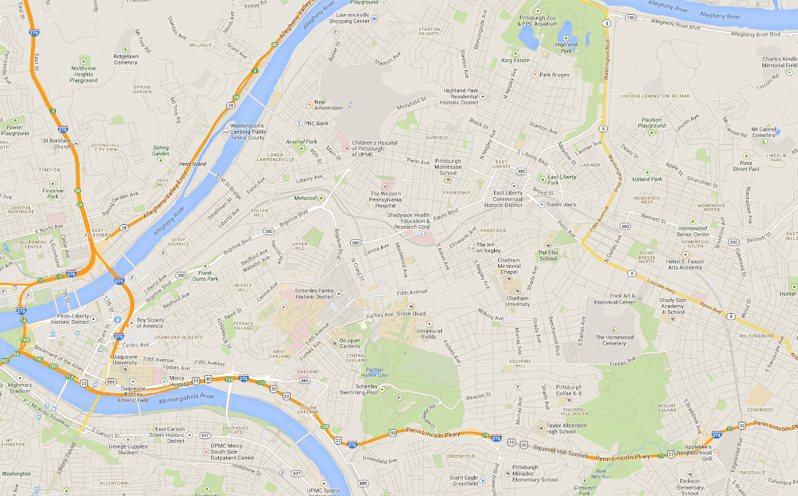
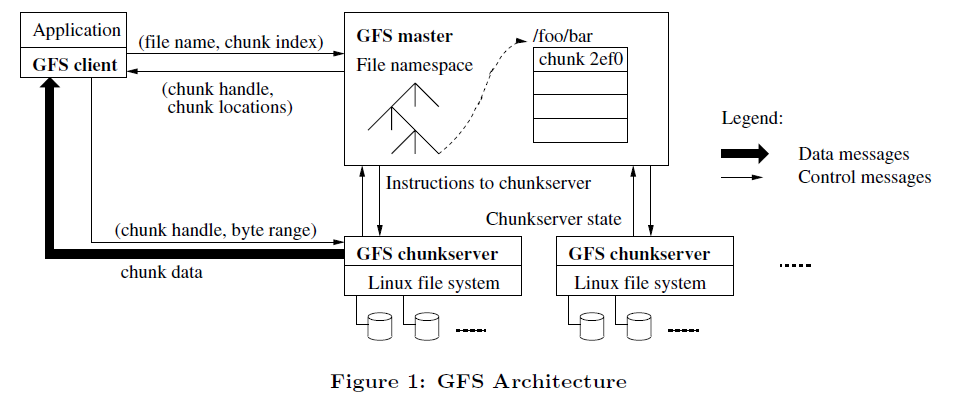
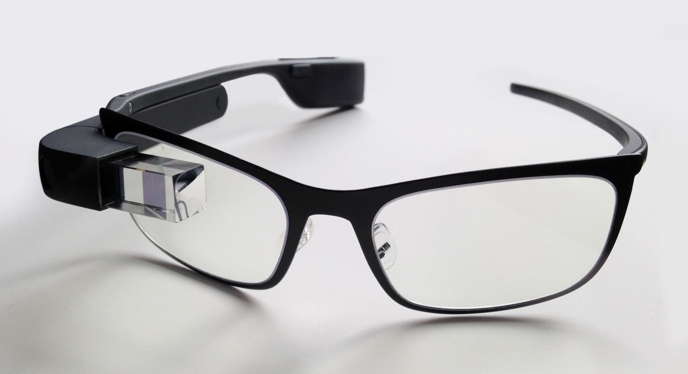
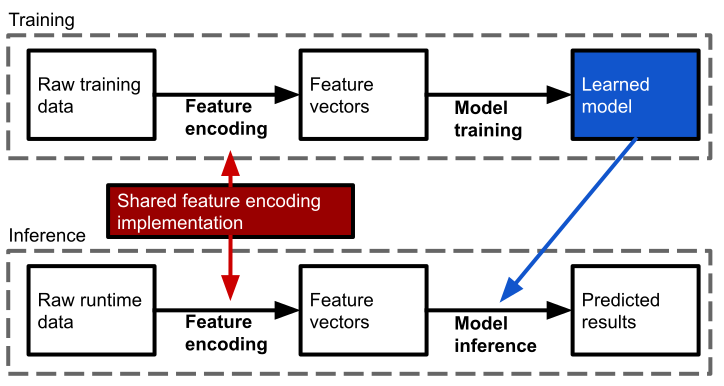
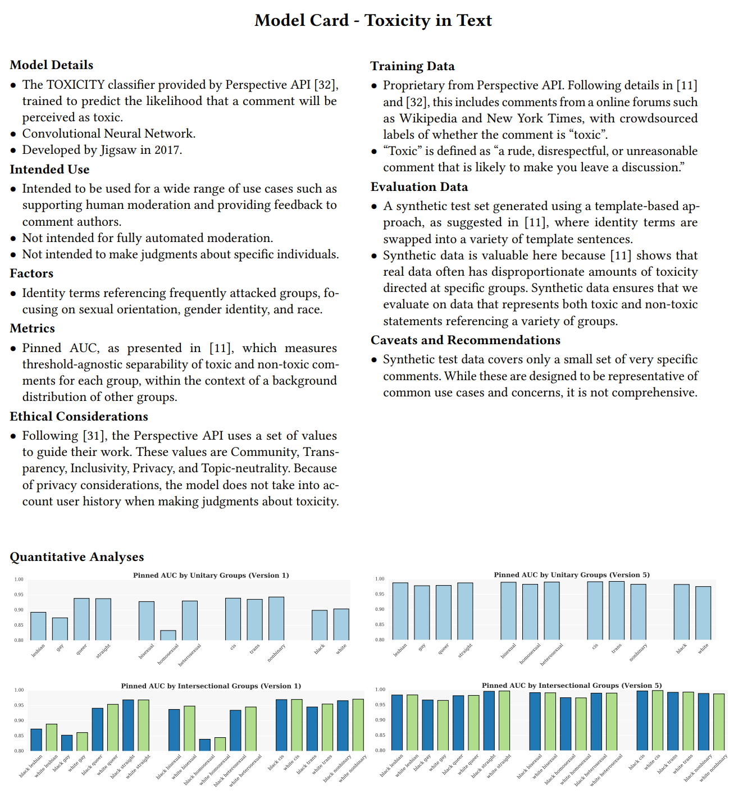
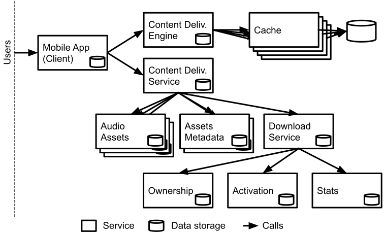

# Deploying a Model

(Introduction to Software Architecture of AI-enabled Systems)

Christian Kaestner

<!-- references -->

Required reading: 
* 🕮 Hulten, Geoff. "[Building Intelligent Systems: A Guide to Machine Learning Engineering.](https://www.buildingintelligentsystems.com/)" Apress, 2018, Chapter 13 (Where Intelligence Lives).
* 📰 Daniel Smith. "[Exploring Development Patterns in Data Science](https://www.theorylane.com/2017/10/20/some-development-patterns-in-data-science/)." TheoryLane Blog Post. 2017.

Recommended reading: Rick Kazman, Paul Clements, and Len Bass. [Software architecture in practice.](https://www.oreilly.com/library/view/software-architecture-in/9780132942799/?ar) Addison-Wesley Professional, 2012, Chapter 1


---

# Learning Goals

* Understand important quality considerations when using ML components
* Follow a design process to explicitly reason about alternative designs and their quality tradeoffs
* Gather data to make informed decisions about what ML technique to use and where and how to deploy it
*
* Create architectural models to reason about relevant characteristics
* Critique the decision of where an AI model lives (e.g., cloud vs edge vs hybrid), considering the relevant tradeoffs 
* Deliberate how and when to update models and how to collect telemetry


---
# Software Architecture 

```mermaid
graph LR;
Requirements --> m((Miracle / genius developers))
m --> Implementation
```

----
## So far: Requirements 

* Identify goals for the system, define success metrics
* Understand requirements, specifications, and assumptions
* Consider risks, plan for mitigations to mistakes
* Approaching component requirements: Understand quality requirements and constraints for models and learning algorithms


----

# Software Architecture 

```mermaid
graph LR;
Requirements --> Architecture
Architecture --> Implementation
```

Focused on reasoning about tradeoffs and desired qualities

----
## From Requirements to Design/Architecture


<!-- .element: class="plain" -->

----
## Software Architecture

> The software architecture of a program or computing system is the **structure or structures** of the system, which comprise **software elements**, the ***externally visible properties*** of those elements, and the relationships among them.
> -- [Kazman et al. 2012](https://www.oreilly.com/library/view/software-architecture-in/9780132942799/?ar)
 
----
## Recall: Systems Thinking


<!-- .element: class="plain" -->

> A system is a set of inter-related components that work together in a particular environment to perform whatever functions are required to achieve the system's objective -- Donella Meadows

----

## Why Architecture? ([Kazman et al. 2012](https://www.oreilly.com/library/view/software-architecture-in/9780132942799/?ar))

* Represents earliest design decisions.
* Aids in **communication** with stakeholders
    * Shows them “how” at a level they can understand, raising questions about whether it meets their needs
* Defines **constraints** on implementation
    * Design decisions form “load-bearing walls” of application
* Dictates **organizational structure**
    * Teams work on different components
* Inhibits or enables **quality attributes**
    * Similar to design patterns
* Supports **predicting** cost, quality, and schedule
    * Typically by predicting information for each component
* Aids in software **evolution**
    * Reason about cost, design, and effect of changes
* Aids in **prototyping**
    * Can implement architectural skeleton early

----

## Case Study: Twitter


Note: Source and additional reading: Raffi. [New Tweets per second record, and how!](https://blog.twitter.com/engineering/en_us/a/2013/new-tweets-per-second-record-and-how.html) Twitter Blog, 2013

----

## Twitter - Caching Architecture


<!-- .element: class="stretch" -->

Notes:

* Running one of the world’s largest Ruby on Rails installations
* 200 engineers
* Monolithic: managing raw database, memcache, rendering the site, and * presenting the public APIs in one codebase
* Increasingly difficult to understand system; organizationally challenging to manage and parallelize engineering teams
* Reached the limit of throughput on our storage systems (MySQL); read and write hot spots throughout our databases
* Throwing machines at the problem; low throughput per machine (CPU + RAM limit, network not saturated)
* Optimization corner: trading off code readability vs performance

----

## Twitter's Redesign Goals

* Performance
    * Improve median latency; lower outliers 
    * Reduce number of machines 10x
+ Reliability
    * Isolate failures
+ Maintainability
    * "We wanted cleaner boundaries with “related” logic being in one place": 
encapsulation and modularity at the systems level (rather than at the class, module, or package level)
* Modifiability
    * Quicker release of new features: "run small and empowered engineering teams that could make local decisions and ship user-facing changes, independent of other teams"

<!-- references -->

Raffi. [New Tweets per second record, and how!](https://blog.twitter.com/engineering/en_us/a/2013/new-tweets-per-second-record-and-how.html) Twitter Blog, 2013

----

## Twitter: Redesign Decisions

* Ruby on Rails -> JVM/Scala 
* Monolith -> Microservices
* RPC framework with monitoring, connection pooling, failover strategies, loadbalancing, ... built in
* New storage solution, temporal clustering, "roughly sortable ids"
* Data driven decision making

<!-- split -->


<!-- .element: class="stretch" -->

----

## Twitter Case Study: Key Insights

* Architectural decisions affect entire systems, not only individual modules
* Abstract, different abstractions for different scenarios
* Reason about quality attributes early
* Make architectural decisions explicit
* Question: **Did the original architect make poor decisions?**


---

# Architectural Modeling and Reasoning
----

Notes: Map of Pittsburgh. Abstraction for navigation with cars.
----

Notes: Cycling map of Pittsburgh. Abstraction for navigation with bikes and walking.
----

Notes: Fire zones of Pittsburgh. Various use cases, e.g., for city planners.
----
## Analysis-Specific Abstractions

* All maps were abstractions of the same real-world construct
* All maps were created with different goals in mind
    - Different relevant abstractions
    - Different reasoning opportunities
* 
* Architectural models are specific system abstractions, for reasoning about specific qualities
* No uniform notation

----

## What can we reason about?


<!-- .element: class="stretch" -->

----

## What can we reason about?



<!-- references -->
Ghemawat, Sanjay, Howard Gobioff, and Shun-Tak Leung. "[The Google file system.](https://ai.google/research/pubs/pub51.pdf)" ACM SIGOPS operating systems review. Vol. 37. No. 5. ACM, 2003.

Notes: Scalability through redundancy and replication; reliability wrt to single points of failure; performance on edges; cost

----
## What can we reason about?


<!-- references -->
Peng, Zi, Jinqiu Yang, Tse-Hsun Chen, and Lei Ma. "A first look at the integration of machine learning models in complex autonomous driving systems: a case study on Apollo." In Proceedings of the 28th ACM Joint Meeting on European Software Engineering Conference and Symposium on the Foundations of Software Engineering, pp. 1240-1250. 2020.

----

## Suggestions for Graphical Notations

* Use notation suitable for analysis
* Document meaning of boxes and edges in legend
* Graphical or textual both okay; whiteboard sketches often sufficient
* Formal notations available


---

# Case Study: Augmented Reality Translation


<!-- .element: class="stretch" -->


Notes: Image: https://pixabay.com/photos/nightlife-republic-of-korea-jongno-2162772/

----
## Case Study: Augmented Reality Translation

----
## Case Study: Augmented Reality Translation

Notes: Consider you want to implement an instant translation service similar toGoogle translate, but run it on embedded hardware in glasses as an augmented reality service.
----
## System Qualities of Interest?

<!-- discussion -->


---
# Architectural Decision: Selecting AI Techniques

What AI techniques to use and why? Tradeoffs?


Notes: Relate back to previous lecture about AI technique tradeoffs, including for example
Accuracy
Capabilities (e.g. classification, recommendation, clustering…)
Amount of training data needed
Inference latency
Learning latency; incremental learning?
Model size
Explainable? Robust?

---
# Deploying a Model is Easy

----
## Deploying a Model is Easy

Model inference component as function/library

```python
from sklearn.linear_model import LogisticRegression
model = … # learn model or load serialized model ...
def infer(feature1, feature2):
    return model.predict(np.array([[feature1, feature2]])
```

----
## Deploying a Model is Easy

Model inference component as a service


```python
from flask import Flask, escape, request
app = Flask(__name__)
app.config['UPLOAD_FOLDER'] = '/tmp/uploads'
detector_model = … # load model…

# inference API that returns JSON with classes 
# found in an image
@app.route('/get_objects', methods=['POST'])
def pred():
    uploaded_img = request.files["images"]
    coverted_img = … # feature encoding of uploaded img
    result = detector_model(converted_img)
    return jsonify({"response":
                result['detection_class_entities']})

```
----
## Deploying a Model is Easy

Model inference component as a service in the cloud

* Package in container or other infrastructure
* Deploy in cloud infrastructure
* Auto-scaling with demand
* MLOps infrastructure to automate all of this
* (more on this later)
*
* Model inference is stateless and embarrassingly parallel
* Almost always deterministic
* "*Stateless Serving Functions Pattern*"


---
# Architectural Decision: Where Should the Model Live?

(Deployment Architecture)

----
## Where Should the Models Live?


<!-- .element: class="plain" -->

Cloud? Phone? Glasses?

What qualities are relevant for the decision?

Notes: Trigger initial discussion


----
## Considerations

* How much data is needed as input for the model?
* How much output data is produced by the model?
* How fast/energy consuming is model execution?
* What latency is needed for the application?
* How big is the model? How often does it need to be updated?
* Cost of operating the model? (distribution + execution)
* Opportunities for telemetry?
* What happens if users are offline?

----
## Breakout: Latency and Bandwidth Analysis of AR Translation

1. Estimate latency and bandwidth requirements between components

2. Discuss tradeoffs among different deployment models


<!-- .element: class="plain stretch" -->

Post on Slack in `#lecture`:
* Recommended deployment for OCR (with justification):
* Recommended deployment for Translation (with justification):


Notes: Identify at least OCR and Translation service as two AI components in a larger system. Discuss which system components are worth modeling (e.g., rendering, database, support forum). Discuss how to get good estimates for latency and bandwidth.

Some data:
200ms latency is noticable as speech pause; 
20ms is perceivable as video delay, 10ms as haptic delay;
5ms referenced as cybersickness threshold for virtual reality
20ms latency might be acceptable

bluetooth latency around 40ms to 200ms

bluetooth bandwidth up to 3mbit, wifi 54mbit, video stream depending on quality 4 to 10mbit for low to medium quality

google glasses had 5 megapixel camera, 640x360 pixel screen, 1 or 2gb ram, 16gb storage


----


----
## From the Reading: When would one use the following designs?

* Static intelligence in the product
* Client-side intelligence (user-facing devices)
* Server-centric intelligence
* Back-end cached intelligence
* Hybrid models
*
* Consider: Offline use, inference latency, model updates, application updates, operating cost, scalability, protecting intellectual property

<!-- discussion -->

Notes:
From the reading:
* Static intelligence in the product
    - difficult to update
    - good execution latency
    - cheap operation
    - offline operation
    - no telemetry to evaluate and improve
* Client-side intelligence
    - updates costly/slow, out of sync problems
    - complexity in clients
    - offline operation, low execution latency
* Server-centric intelligence
    - latency in model execution (remote calls)
    - easy to update and experiment
    - operation cost
    - no offline operation
* Back-end cached intelligence
    - precomputed common results
    - fast execution, partial offline 
    - saves bandwidth, complicated updates
* Hybrid models


----
## Where Should Feature Encoding Happen?


<!-- .element: class="plain" -->

*Should feature encoding happen server-side or client-side? Tradeoffs?*

Note: When thinking of model inference as a component within a system, feature encoding can happen with the model-inference component or can be the responsibility of the client. That is, the client either provides the raw inputs (e.g., image files; dotted box in the figure above) to the inference service or the client is responsible for computing features and provides the feature vector to the inference service (dashed box). Feature encoding and model inference could even be two separate services that are called by the client in sequence. Which alternative is preferable is a design decision that may depend on a number of factors, for example, whether and how the feature vectors are stored in the system, how expensive computing the feature encoding is, how often feature encoding changes, how many models use the same feature encoding, and so forth. For instance, in our stock photo example, having feature encoding being part of the inference service is convenient for clients and makes it easy to update the model without changing clients, but we would have to send the entire image over the network instead of just the much smaller feature vector for the reduced 300 x 300 pixels.


----
## Reusing Feature Engineering Code



<!-- .element: class="plain" -->


Avoid *training–serving skew*

----
## The Feature Store Pattern

* Central place to store, version, and describe feature engineering code
* Can be reused across projects
* Possible caching of expensive features


Many open source and commercial offerings, e.g.,  Feast, Tecton, AWS SageMaker Feature Store

----
## Tecton Feature Store

<iframe width="560" height="315" src="https://www.youtube.com/embed/u_L_V2HQ_nQ" title="YouTube video player" frameborder="0" allow="accelerometer; autoplay; clipboard-write; encrypted-media; gyroscope; picture-in-picture" allowfullscreen></iframe>

----
## More Considerations for Deployment Decisions

* Coupling of ML pipeline parts
* Coupling with other parts of the system
* Ability for different developers and analysts to collaborate
* Support online experiments
* Ability to monitor


----
## Real-Time Serving; Many Models


<!-- references -->
Peng, Zi, Jinqiu Yang, Tse-Hsun Chen, and Lei Ma. "A first look at the integration of machine learning models in complex autonomous driving systems: a case study on Apollo." In Proceedings of the 28th ACM Joint Meeting on European Software Engineering Conference and Symposium on the Foundations of Software Engineering, pp. 1240-1250. 2020.


----
## Infrastructure Planning (Facebook Example)


<!-- references -->

Hazelwood, Kim, Sarah Bird, David Brooks, Soumith Chintala, Utku Diril, Dmytro Dzhulgakov, Mohamed Fawzy et al. "Applied machine learning at facebook: A datacenter infrastructure perspective." In 2018 IEEE International Symposium on High Performance Computer Architecture (HPCA), pp. 620-629. IEEE, 2018.

----
## Capacity Planning (Facebook Example)

<!-- small -->

| Services | Relative Capacity | Compute | Memory |
|--|--|--|--|
| News Feed | 100x | Dual-Socket CPU | High |
| Facer (face recognition) | 10x | Single-Socket CPU | Low |
| Lumos (image understanding) | 10x | Single-Socket CPU | Low |
| Search | 10x | Dual-Socket CPU | High |
| Lang. Translation | 1x | Dual-Socket CPU | High |
| Sigma (anomaly and spam detection) | 1x | Dual-Socket CPU | High |
| Speech Recognition | 1x | Dual-Socket CPU | High |

Trillions of inferences per day, in real time

Preference for cheap single-CPU machines whether possible

Different latency requirements, some "nice to have" predictions

Some models run on mobile device to improve latency and reduce communication cost

<!-- references -->

Hazelwood, Kim, Sarah Bird, David Brooks, Soumith Chintala, Utku Diril, Dmytro Dzhulgakov, Mohamed Fawzy et al. "Applied machine learning at facebook: A datacenter infrastructure perspective." In 2018 IEEE International Symposium on High Performance Computer Architecture (HPCA), pp. 620-629. IEEE, 2018.


----
## Operational Robustness

* Redundancy for availability?
* Load balancer for scalability?
* Can mistakes be isolated?
    - Local error handling?
    - Telemetry to isolate errors to component?
* Logging and log analysis for what qualities?


---
# Composing Models

----
## Ensemble and metamodels


<!-- .element: class="plain" -->

----
## Decomposing the problem, sequential


<!-- .element: class="plain" -->

----
## Cascade/two-phase prediction


<!-- .element: class="plain" -->


---
# Documenting Model Inference Interfaces


----
## Why Documentation

* Model inference between teams:
  * Data scientists developing the model
  * Other data scientists using the model, evolving the model
  * Software engineers integrating the model as a component
  * Operators managing model deployment
* Will this model work for my problem?
* What problems to anticipate?

----
## Classic API Documentation


```java
/**
 * compute deductions based on provided adjusted 
 * gross income and expenses in customer data.
 *
 * see tax code 26 U.S. Code A.1.B, PART VI
 */
float computeDeductions(float agi, Expenses expenses);
```


----
## What to Document for Models?

<!-- discussion -->

----
## Documenting Input/Output Types for Inference Components

```js
{
  "mid": string,
  "languageCode": string,
  "name": string,
  "score": number,
  "boundingPoly": {
    object (BoundingPoly)
  }
}
```
From Google’s public [object detection API](https://cloud.google.com/vision/docs/object-localizer).

----
## Documentation beyond Input/Output Types

* Intended use cases, model capabilities and limitations
* Supported target distribution (vs preconditions)
* Accuracy (various measures), incl. slices, fairness
* Latency, throughput, availability (service level agreements)
* Model qualities such as explainability, robustness, calibration
* Ethical considerations (fairness, safety, security, privacy)


**Example for OCR model? How would you describe these?**

----
## Model Cards 

* Proposal and template for documentation from Google
* 1-2 page summary
* Focused on fairness
* Includes
  * Intended use, out-of-scope use
  * Training and evaluation data
  * Considered demographic factors
  * Accuracy evaluations
  * Ethical considerations
* Widely discussed, but not frequently adopted

<!-- references -->
Mitchell, Margaret, Simone Wu, Andrew Zaldivar, Parker Barnes, Lucy Vasserman, Ben Hutchinson, Elena Spitzer, Inioluwa Deborah Raji, and Timnit Gebru. "[Model cards for model reporting](https://arxiv.org/abs/1810.03993)." In *Proceedings of the conference on fairness, accountability, and transparency*, pp. 220-229. 2019.

----

<!-- .element: class="stretch" -->

Example from Model Cards paper

----

<!-- .element: class="stretch" -->

From: https://modelcards.withgoogle.com/object-detection

----
## FactSheets 

* Proposal and template for documentation from IBM
* Intended to communicate intended qualities and assurances
* Longer list of criteria, including
  * Service intention
  * Technical description
  * Intended use
  * Target distribution
  * Own and third-party evaluation results
  * Safety and fairness considerations
  * Explainability
  * Preparation for drift and evolution
  * Security
  * Lineage and versioning


<!-- references -->
Arnold, Matthew, Rachel KE Bellamy, Michael Hind, Stephanie Houde, Sameep Mehta, Aleksandra Mojsilović, Ravi Nair, Karthikeyan Natesan Ramamurthy, Darrell Reimer, Alexandra Olteanu, David Piorkowski, Jason Tsay, and Kush R. Varshney. "[FactSheets: Increasing trust in AI services through supplier's declarations of conformity](https://arxiv.org/pdf/1808.07261.pdf)." *IBM Journal of Research and Development* 63, no. 4/5 (2019): 6-1.

----
## Recall: Correctness vs Fit

* Without a clear specification a model is difficult to document
* Need documentation to allow evaluation for *fit*
* Description of *target distribution* is a key challenge


---
# Design Patterns for AI Enabled Systems

(no standardization, *yet*)

----
## Design Patterns are Codified Design Knowledge

Vocabulary of design problems and solutions


Example: *Observer pattern* object-oriented design pattern describes a solution how objects can be notified when another object changes without strongly coupling these objects to each other

----
## Common System Structures

* Client-server architecture
* Multi-tier architecture
* Service-oriented architecture and microservices
* Event-based architecture
* Data-flow architecture

----
## Multi-Tier Architecture


<!-- .element: class="stretch plain" -->

Based on: Yokoyama, Haruki. "Machine learning system architectural pattern for improving operational stability." In 2019 IEEE International Conference on Software Architecture Companion (ICSA-C), pp. 267-274. IEEE, 2019.

----
## Microservices


<!-- .element: class="stretch plain" -->


(more later)


----
## Patterns for ML-Enabled Systems

* Stateless/serverless Serving Function Pattern
* Feature-Store Pattern
* Batched/precomuted serving pattern
* Two-phase prediction pattern
* Batch Serving Pattern
* Decouple-training-from-serving pattern


----
## Anti-Patterns

* Big Ass Script Architecture
* Dead Experimental Code Paths
* Glue code
* Multiple Language Smell
* Pipeline Jungles
* Plain-Old Datatype Smell
* Undeclared Consumers


<!-- references -->
* Washizaki, Hironori, Hiromu Uchida, Foutse Khomh, and Yann-Gaël Guéhéneuc. "[Machine Learning Architecture and Design Patterns](http://www.washi.cs.waseda.ac.jp/wp-content/uploads/2019/12/IEEE_Software_19__ML_Patterns.pdf)." Draft, 2019
* Sculley, David, Gary Holt, Daniel Golovin, Eugene Davydov, Todd Phillips, Dietmar Ebner, Vinay Chaudhary, Michael Young, Jean-Francois Crespo, and Dan Dennison. "[Hidden technical debt in machine learning systems](http://papers.nips.cc/paper/5656-hidden-technical-debt-in-machine-learning-systems.pdf)." In Advances in neural information processing systems, pp. 2503-2511. 2015.

----
## Example: Chatbot


<!-- references -->

Image source: Yokoyama, Haruki. "Machine learning system architectural pattern for improving operational stability." In 2019 IEEE International Conference on Software Architecture Companion (ICSA-C), pp. 267-274. IEEE, 2019.

----
## Real systems are complex


<!-- references -->
Peng, Zi, Jinqiu Yang, Tse-Hsun Chen, and Lei Ma. "A first look at the integration of machine learning models in complex autonomous driving systems: a case study on Apollo." In Proceedings of the 28th ACM Joint Meeting on European Software Engineering Conference and Symposium on the Foundations of Software Engineering, pp. 1240-1250. 2020.


---

# Summary

* Software architecture is an established discipline to reason about design alternatives
* Understand relevant quality goals 
* Problem-specific modeling and analysis: Gather estimates, consider design alternatives, make tradeoffs explicit
* Examples of important design decision:
    - modeling technique to use
    - where to deploy the model
    - how and how much telemetry to collect
    - whether and how to modularize the model service
    - when and how to update models
    - build vs buy, cloud resources


